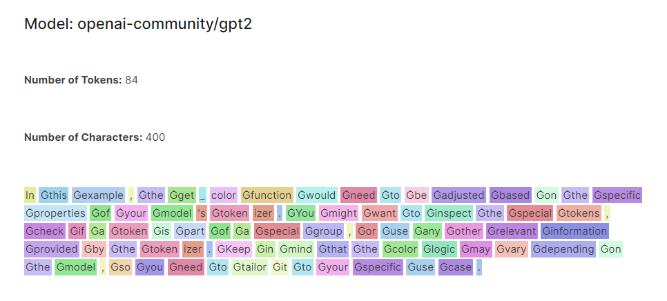
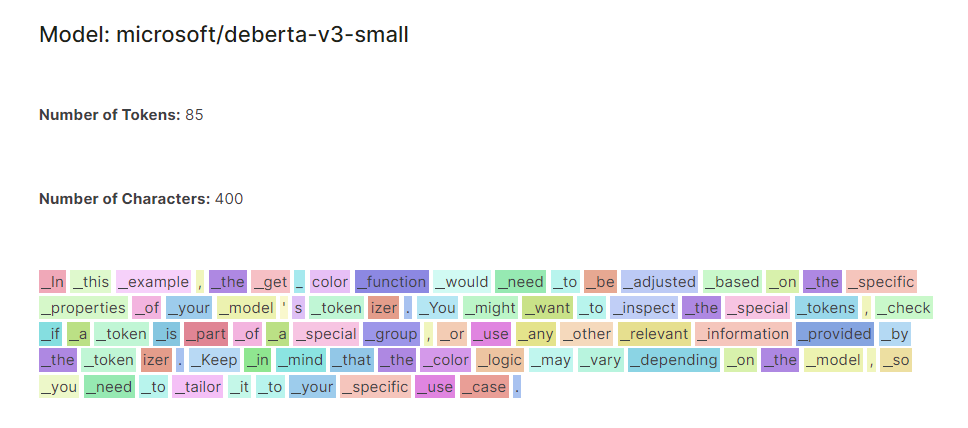

# tokviz

## File Structure

```
tokviz/
├── assets/
│   ├── example-deberta-v3-small.png
│   └── example-gpt2.png
├── tokviz/
│   ├── __init__.py
│   └── visualization.py
├── README.md
├── LICENSE
├── setup.py
└── pyproject.toml
```


`tokviz` is a Python library for visualizing tokenization patterns across different language models. This library offers a comprehensive platform for researchers, data scientists, and NLP enthusiasts to gain insights into how different language models process and tokenize text.

## Key Features:

**Model Comparison:** The visualizer allows users to compare tokenization patterns across multiple language models, including popular models like GPT-2, DistilGPT-2, and DeBERTa-v3-small. By displaying color-coded tokens side by side, users can easily identify differences and similarities in tokenization behavior.

**Flexible Input:** Users can input any text of their choice, allowing for dynamic exploration of tokenization patterns across diverse textual inputs. Whether analyzing short sentences, paragraphs, or entire documents, the visualizer adapts to the user's input for comprehensive analysis.

**Color-Coded Visualization:** Tokens are color-coded based on their properties and index, providing a visually intuitive representation of tokenization patterns. This enables users to quickly identify individual tokens and patterns within the text, facilitating deeper analysis and interpretation.

## Installation

You can install tokviz via pip:

```bash
pip install tokviz
```

## Usage

```python
from tokviz import token_visualizer

# Define input text
text = "In this example, the get_color function would need to be adjusted based on the specific properties of your model's tokenizer. \
You might want to inspect the special tokens, check if a token is part of a special group, \
or use any other relevant information provided by the tokenizer. \
Keep in mind that the color logic may vary depending on the model, \
so you need to tailor it to your specific use case."

# Compare tokenization across different language models
token_visualizer(text, models=['microsoft/deberta-v3-small', 'openai-community/gpt2'])
```
This will visualize tokenization patterns for the input text using the specified language models. You can pass a list of model names or identifiers to the models parameter. By default, it compares tokenization with the GPT-2 model.




## References

This library is based on the notebook [LLM Tokenizer Visualizer](https://www.kaggle.com/code/deeepsig/llm-tokenizer-visualizer)


